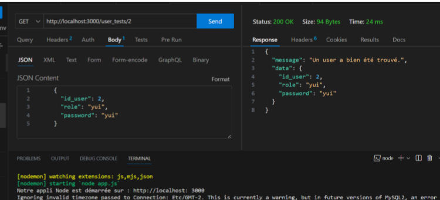
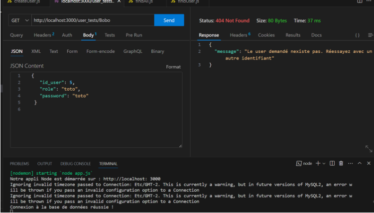
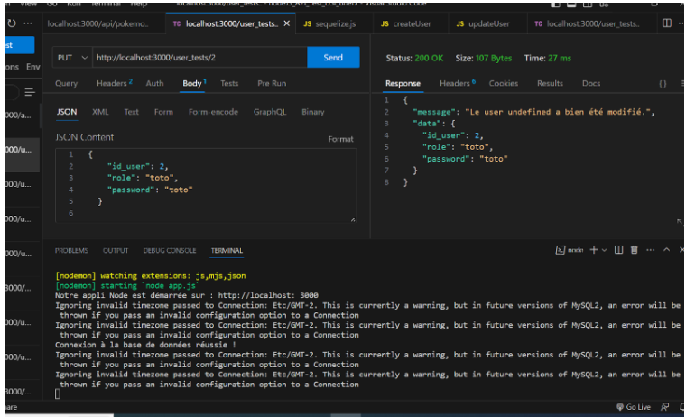
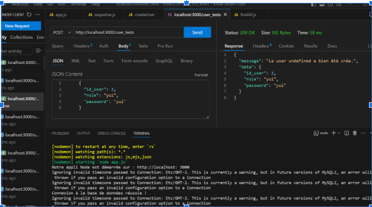
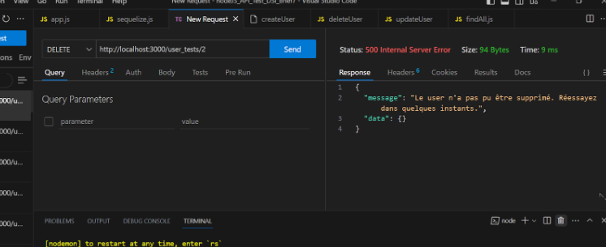
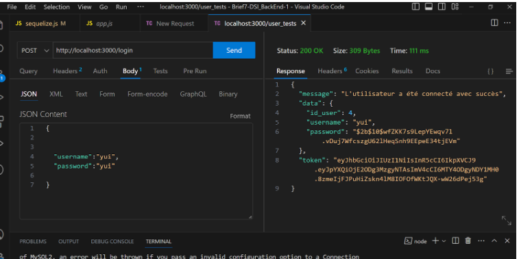
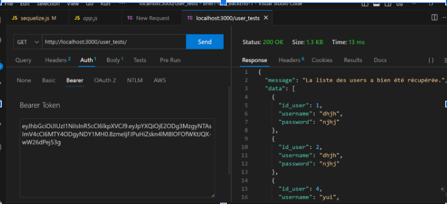
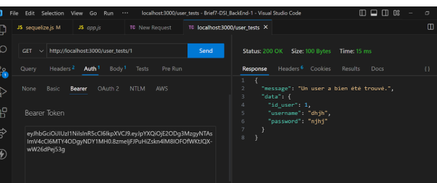

# BRIEF 7

Marie-Claire Kasai
Anne-Sophie Vandingenen
David Regnier
Faouzilha Hafsi
Romain Cilia

Explique comment tu as developpé les end point de ton api en expliquant avec un exemple

## Développement des endpoints de l’API rest du projet DSI

Le développement d'un point de terminaison d'une API REST peut être divisé en plusieurs étapes. Voici les étapes typiques du développement d'un point de terminaison d'API REST :

- Analyse des besoins : Comprenez les exigences fonctionnelles et non fonctionnelles de l'API REST, y compris les objectifs commerciaux, les cas d'utilisation, les entités de données, les opérations attendues, les formats de données, etc.
Conception de l'API : Concevez la structure de l'API REST en identifiant les ressources principales, les relations entre les ressources et les opérations CRUD (Create, Read, Update, Delete) à prendre en charge. Déterminez également les conventions d'URI, les méthodes HTTP appropriées (GET, POST, PUT, DELETE, etc.), les formats de données (JSON, XML, etc.) et les paramètres requis.
- Mise en place de l'environnement de développement : Configurez votre environnement de développement avec les outils et les frameworks nécessaires pour créer l'API REST. Node Js avec Express.
- Implémentation des fonctionnalités : Écrivez le code pour mettre en œuvre chaque opération de l'API REST en utilisant les fonctionnalités fournies par le framework choisi. Cela peut inclure la définition de modèles de données, de contrôleurs, de routes, de validations de données, d'opérations de persistance, etc.
- Gestion des erreurs et des exceptions : Gérez les erreurs et les exceptions qui peuvent survenir lors de l'exécution des opérations de l'API REST. Fournissez des réponses d'erreur appropriées avec les codes de statut HTTP correspondants, ainsi que des messages d'erreur descriptifs pour aider les développeurs consommateurs de l'API à comprendre les problèmes.
- Documentation de l'API : Créez une documentation détaillée de l'API REST pour aider les développeurs à comprendre comment utiliser l'API, y compris les endpoints disponibles, les paramètres acceptés, les exemples de requêtes et de réponses, les codes de statut HTTP, etc. Vous pouvez utiliser des outils comme Swagger ou OpenAPI pour générer automatiquement la documentation de l'API..
_ Sécurité de l'API : Mettez en place des mécanismes de sécurité pour protéger l'API contre les attaques telles que l'injection SQL, le Cross-Site Scripting (XSS), les attaques par force brute, etc. Cela peut inclure l'authentification et l'autorisation des utilisateurs, l'utilisation de tokens d'accès, la mise en œuvre de CORS (Cross-Origin Resource Sharing), etc.
- Déploiement de l'API : Déployez l'API sur un serveur ou une infrastructure appropriée, en tenant compte des considérations de mise à l'échelle et de disponibilité. Assurez-vous que l'API est accessible et fonctionnelle pour les consommateurs.

## Mise en place d’une api rest

### Dans le fichier sequelize.js:
     
     const { Sequelize, DataTypes} = require('sequelize');

La ligne de code const { Sequelize, DataTypes } = require('sequelize'); importe les modules Sequelize et DataTypes à partir de la bibliothèque Sequelize.

**Sequelize**: C'est la classe principale de Sequelize. Elle représente l'instance principale de Sequelize qui est utilisée pour configurer la connexion à la base de données, définir les modèles et effectuer des opérations sur la base de données.
**DataTypes**: C'est un objet fourni par Sequelize qui contient les types de données qu’on peut utiliser pour définir les attributs des modèles

    const sequelize = new Sequelize('dsi_sensibilisation', 'root', 'root', {
        host: 'localhost',
        dialect: 'mysql',
        dialectOptions: {
            timezone: 'Etc/GMT-2',
        },
        logging: false
    })
Création d’une instance Sequelize avec les informations de connexion à la base de données MySQL.

    sequelize
        .query('SELECT 1')
        .then(([result]) => {
            console.log('Connexion à la base de données réussie !');
        })
        .catch(error => {
            console.error('Erreur de connexion à la base de données :', error);
    });
Cette requête sélectionne la valeur 1 pour vérifier si la connexion à la base de données est réussie.

### Fichier users.js dans le dossier models:

    module.exports = (sequelize, DataTypes) => {
        return sequelize.define('user_test', {
        id_user: {
            type: DataTypes.INTEGER,
            primaryKey: true,
            autoIncrement: true
        },.
        username: {
            type: DataTypes.STRING,
            allowNull: false
        },
        password: {
            type: DataTypes.STRING,
            allowNull: false
        }
        }, {
        tableName: 'user_tests',
        timestamps: false,
        })
    }
sert de modèle pour remplir la base de données en format sql.

### Dans le fichier app.js:

    const express = require('express');
Cette ligne importe le module Express Elle permet d'utiliser les fonctionnalités fournies par Express dans notre application.

    const bodyParser = require('body-parser');
Cette ligne importe le module body-parser, qui est utilisé pour analyser le corps des requêtes HTTP et récupérer les données au format JSON ou URL-encoded. Cela nous permettra de traiter les données envoyées par les clients de l'API.
    
    const sequelize = require('./src/db/sequelize');
Cette ligne importe le module sequelize, qui est une bibliothèque ORM (Object-Relational Mapping) pour Node.js. Elle est utilisée pour interagir avec une base de données relationnelle, probablement configurée dans le fichier sequelize.js situé dans le dossier src/db.
    
    const app = express();
 Cette ligne crée une instance de l'application Express, qui représente notre serveur web. Nous utiliserons cette instance pour configurer les routes de notre API et démarrer le serveur.
    
    const port = 3000 ;
Cette ligne définit le port sur lequel le serveur écoutera les requêtes entrantes. Dans cet exemple, le serveur sera accessible via http://localhost:3000.
    
    app.use(bodyParser.json());
Analyse le corps de la requête et transforme les données JSON en un objet JavaScript utilisable.
    
    require('./src/routes/findAll')(app);
    require('./src/routes/findUser')(app);
    require('./src/routes/createUser')(app);
    require('./src/routes/deleteUser')(app);
    require('./src/routes/updateUser')(app);
    require('./src/routes/login')(app);
Importation des fichiers de routes à partir du repertoire routes.L'objet app est passé en argument pour configurer cette route. On premet au fichier de route d’intéragir avec l’objet app d’express qui configure les routes. Ce qui signifie définir les endpoints (points d'extrémité) de l'API et spécifier les actions qui doivent être effectuées lorsque ces endpoints sont atteints.
Les routes déterminent comment les différentes requêtes HTTP (GET, POST, PUT, DELETE, etc.) seront traitées par l'API. Elles permettent de spécifier les URL auxquelles les clients de l'API peuvent accéder et les actions qui doivent être exécutées en réponse à ces requêtes.

### findAll.js exemple d’un fichier de route:

    const User = UserModel(sequelize, DataTypes);
Une fois que vous avez créé l'instance du UserModel, on peut l'utiliser pour interagir avec la table des utilisateurs dans notre base de données. Par exemple, nous pouvons utiliser des méthodes fournies par Sequelize telles que create, findAll, update, destroy, etc., pour effectuer des opérations CRUD (Create, Read, Update, Delete) sur les utilisateurs.
Dans findAll.js  la méthode findAll qui permettra le GET “général”.
Voici donc une fonction qui définit une route GET/user_tests dans une application express
Permettant donc de renvoyer une réponse “liste de tous les utilisateurs” sous format JSON au client.

    module.exports = (app) => {
    // instance d'express
        app.get('/user_tests',auth, (req, res) => {
            User.findAll()
            .then(users => {
                // enregistre une fonction de rappel qui sera exécutée lorsque la méthode findAll() sera résolue avec succès. La fonction de rappel prend un paramètre users, qui est un tableau contenant tous les utilisateurs récupérés.
                const message = 'La liste des users a bien été récupérée.'
                res.json({ message, data: users});
                // Envoie une réponse JSON contenant le message et les données des utilisateurs récupérés.
            })
            .catch( error => {
                const message = `La liste des users n'a pas pu être récupérée. Réessayez dans quelques instants.`
                res.status(500).json({message, data: error})
            })
        })
    }

### createUser.js Même logique pour le reste du CRUD,différence toutefois avec le fichier:

    const { User } = require('../db/sequelize')
    const auth = require("../auth/auth");
    const { ValidationError, UniqueConstraintError} = require('sequelize');
    const bcrypt = require('bcrypt');

    module.exports = (app) => {
    app.post('/user_tests', (req, res) => {
        var password = req.body.password;
        var username = req.body.username;
        bcrypt.hash(password , 10)
        .then(hash => {
            User.create({ username: username , password: hash})
        // User.create(req.body)
        .then(users => {
            const message = `L\' user  a bien été crée.`
            res.json({ message, data: users })
        })
        })
    )
On récupère ici le username et le password renseigné par un utilisateur et on le stocke dans les variables password et username.

Méthode hash qui a 2 paramètres (mot de passe renseigné en dur et le saltrounds = temps nécessaire pour hacher correctement un mot de passe plus il est long plus il sera difficile d'être décrypté).

On récupère ensuite le mot de passe crypté et poussé en base de données (ne pas le confondre avec le mot de passe en clair! nous sauvegardons en bdd le mot de passe une fois qu'il est crypté et jamais avant) ainsi que l'utilisateur quand on vérifie en bdd on voit que le mot de passe est désormais hashé avant d'être stocké en bdd.

     .catch(error => {
        if(error instanceof ValidationError 
    {return res.status(400).json({message: error.message, data: error})}
        if(error instanceof UniqueConstraintError)
    { return res.status(400).json({message : error.message, data: error})}
        const message = 'L\' utilisateur n\a pas pu être ajouté. Réessayez dans quelques instants.'
    res.status(500).json({message, data: error})})})}
Lorsqu'une erreur se produit dans la promesse précédente (par exemple, lors de l'ajout d'un utilisateur à la base de données), le code est capturé dans le bloc catch pour gérer l'erreur. 
Les conditions if permettent de vérifier le type d'erreur qui s'est produite et d'envoyer une réponse JSON appropriée.
Si l'erreur est une ValidationError, cela signifie qu'il y a eu une violation des règles de validation définies pour le modèle. Dans ce cas, une réponse JSON avec un code de statut 400 (Bad Request) est renvoyée, contenant le message d'erreur de validation et l'objet d'erreur ValidationError.
Si l'erreur est une UniqueConstraintError, cela signifie qu'il y a eu une violation de contrainte d'unicité dans la base de données. Par exemple, si vous avez une contrainte d'unicité sur l'email de l'utilisateur et que l'email est déjà utilisé, cette erreur sera déclenchée. Dans ce cas, une réponse JSON avec un code de statut 400 est renvoyée, contenant le message d'erreur et l'objet d'erreur UniqueConstraintError.
Si l'erreur ne correspond à aucun des types précédents, il est considéré comme une erreur inattendue. Dans ce cas, une réponse JSON avec un code de statut 500 (Internal Server Error) est renvoyée, contenant un message générique indiquant que l'utilisateur n'a pas pu être ajouté et l'objet d'erreur.
Cela permet de capturer et de gérer différents types d'erreurs pouvant survenir lors de l'ajout d'un utilisateur, et de renvoyer des réponses appropriées aux clients de l'API en fonction du type d'erreur rencontrée.

### Fichier auth.js dans dossier auth:

    // middleware de sécurisation des échanges entre le client et l'API REST, vérification validité du jeton transmis par client lors des requêtes
    const jwt = require('jsonwebtoken')
    const privateKey = require('../auth/private_key')
    
    module.exports = (req, res, next) => {
    const authorizationHeader = req.headers.authorization
        // récupération de l'en-tête HTTP authorization. c'est dans cet en-tête que transitera le jeton jwt envoyé par le consommateur
    
    if(!authorizationHeader) {
        const message = `Vous n'avez pas fourni de jeton d'authentification. Ajoutez-en un dans l'en-tête de la requête.`
        return res.status(401).json({ message })
    }
        // vérification si jeton a bien été fourni
        const token = authorizationHeader.split(' ')[1]
        // voir Bearer
        const decodedToken = jwt.verify(token, privateKey, (error, decodedToken) => {
        if(error) {
            // vérification jeton valide
        const message = `L'utilisateur n'est pas autorisé a accèder à cette ressource.`
        return res.status(401).json({ message, data: error })
        }
        // récupération jeton envoyé par l'user dans une const token
        const userId = decodedToken.userId
        if (req.body.userId && req.body.userId !== userId) {
        const message = `L'identifiant de l'utilisateur est invalide.`
        res.status(401).json({ message })
        } else {
        next();
        //   next => authentif ok permet accès aux endpoints demandés.
        }
    })
    }

### Fichier private_key.js:

    module.exports = 'CUSTOM_PRIVATE_KEY';

=> Enregistrement et authentification de l'utilisateur:

Lorsque l'utilisateur s'inscrit ou se connecte avec ses identifiants (nom d'utilisateur/mot de passe), le serveur vérifie les informations d'identification et génère un JWT.
Le JWT est généralement composé de trois parties : l'en-tête (header), les données (payload) et la signature.
L'en-tête contient des informations sur le type de jeton (JWT) et l'algorithme de hachage utilisé pour la signature.
Les données (payload) contiennent les informations de l'utilisateur (par exemple, l'ID d'utilisateur, le rôle, les autorisations, etc.) et peuvent également contenir d'autres métadonnées.
La signature est générée en utilisant une clé secrète connue uniquement par le serveur.
Stockage du JWT côté client :
Le JWT est renvoyé au client et stocké côté client, généralement dans le stockage local (localStorage) ou dans un cookie sécurisé (httpOnly cookie).
Le client doit inclure le JWT dans les en-têtes de toutes les requêtes ultérieures pour prouver son identité.
Authentification côté serveur :
Lorsque le client envoie une requête au serveur, le JWT est inclus dans les en-têtes (habituellement dans l'en-tête **Authorization** avec la valeur **Bearer** <jwt>).
Le serveur vérifie la validité du JWT en vérifiant la signature à l'aide de la clé secrète.
Si la signature est valide, le serveur extrait les données du JWT et peut utiliser ces informations pour identifier l'utilisateur et vérifier ses autorisations.
Gestion de l'expiration et du renouvellement du JWT :
Le JWT peut être configuré avec une durée de validité limitée (par exemple, 15 minutes, 1 heure, etc.).
Lorsque le JWT expire, le client doit obtenir un nouveau JWT en se reconnectant ou en utilisant un mécanisme de renouvellement de jeton (par exemple, en utilisant un jeton de rafraîchissement).
Avantages de l'authentification JWT :
Les JWT sont autocontenus, ce qui signifie que toutes les informations nécessaires à l'authentification sont incluses dans le jeton lui-même, éliminant ainsi le besoin de consulter une base de données à chaque demande d'authentification.
Les JWT peuvent être utilisés dans des architectures distribuées, car ils ne nécessitent pas de stockage centralisé du jeton côté serveur.
Les JWT peuvent être utilisés pour véhiculer des informations supplémentaires sur l'utilisateur, telles que le rôle ou les autorisations, ce qui facilite l'autorisation côté serveur.

### Fichier login.js:

    const { User } = require('../db/sequelize');
    const bcrypt = require('bcrypt');
    const jwt = require('jsonwebtoken');
    const privateKey = require('../auth/private_key');
    
    module.exports = (app) => {
    app.post('/login', (req, res) => {
    
        User.findOne({ where: { username: req.body.username } }).then(users => {
            // requête pour obtenir les informations d'un utilisateur avec la méthode findOne
            if(!users){
                const message = "L'utilisateur demandé n'existe pas.";
                return res.status(404).json({message});
            }
            // vérification si user existe sinon retourne message erreur avec code statut 404

            bcrypt.compare(req.body.password, users.password).then(isPasswordValid => {
            // compare du module bcrypt: permet de comparer le mdp saisi user avec le mdp encrypté dans la bdd. Evalue si mdp en clair est le même que celui sécurisé. promesse: car opération longue, il faut décrypter le mdp pour le comparer d'où la promesse car tmt async.
                if(!isPasswordValid) {
                const message = 'Le mot de passe est invalide.'
                return res.status(401).json({message});
                }
                // 401 car pas une ressource qui n'a pas été trouvée mais un droit d'accès ko

                // jwt
                const token = jwt.sign(
                    // génération jeton jwt avec la méthode sign du module jwt, elle est composée de 3 paramètres pour engendrer un ejeton jwt. On le reécupère dans une constante token. Puis retour du jeton crée aux client l34
                    { userId : users.id_user },
                    privateKey,
                    { expiresIn: '24h'}
                )

                const message = `L'utilisateur a été connecté avec succès`;
                return res.json({ message, data: users, token });
            // vérification mdp erroné
        })
        })
        .catch(error => {
            const message = "L'utilisateur n'a pas été connecté avec succès. Réessayez.";
            return res.json({message});
        })
        // cas d'erreur générique du endpoint: exemple appel réseau ko
    })
    }

### ssl dans app.js:

**Le protocole SSL (Secure Sockets Layer) était le protocole cryptographique le plus largement utilisé pour assurer la sécurité des communications sur Internet**.

Le SSL créé un canal sécurisé entre deux machines ou appareils communiquant sur Internet ou un réseau interne. Son usage le plus courant est la sécurisation de la communication entre un navigateur web et un serveur web. L’adresse URL passe alors de HTTP a HTTPS, le ‘S’ signifiant ‘sécurisé’.

Le fait que les données transférées entre le navigateur web et le serveur web ou entre d'autres terminaux soient transmises en texte clair rend le protocole « http » vulnérable aux attaques d’espionnage. Les pirates informatiques peuvent donc intercepter et voir des données confidentielles, telles que les informations de carte bancaire et les informations de connexion. Lorsque des données sont envoyées via un navigateur qui utilise le protocole « https », le SSL garantit que celles-ci seront chiffrées et protégées contre toute interception.

**Le SSL fournit les éléments nécessaires pour crypter à la fois le canal et les données transmises en ligne**. 
Le protocole établit une connexion privée entre le navigateur et le serveur web via un processus connu sous le nom de « **SSL Handshake** ».
La prise de contact SSL utilise trois clés pour établir une connexion privée : les clés privée, publique et de session. Si les données sont chiffrées avec la clé privée, seule la clé publique peut les déchiffrer. D’autre part, la clé privée est la seule chose qui peut déchiffrer les informations chiffrées avec la clé publique.
Les clés privées et publiques sont utilisées lors de la prise de contact SSL pour créer une clé de session sécurisée qui cryptera toutes les données transmises.

6 étapes pour le SSL handshake:
Le navigateur web (c’est-à-dire le client) se connecte à un site web sécurisé par SSL (c’est-à-dire un serveur SSL) et demande que le site web s’identifie. C’est ce qu’on appelle le « bonjour client ».
Pour s’identifier, le site envoie une copie de son certificat SSL et de la clé publique du site. Cette réponse est appelée « bonjour du serveur ».
Ensuite, le client vérifie le certificat par rapport à une liste d’autorités de certification (CA) et s’assure que le certificat n’a pas expiré ou n’a pas été révoqué.
Si le certificat est authentique, le client lui fera confiance et créera une clé de session symétrique à l’aide de la clé publique du site web.
Le serveur SSL déchiffre ensuite la clé de session avec la clé privée et envoie un accusé de réception chiffré pour démarrer la session.
Toutes les données transmises entre le site web et le navigateur sont cryptées avec la clé de session.

Il faut donc ajouter dans notre point d'entrée app.js:

    const fs = require('fs'); // fourni une API pour interagir avec le file system( permettant lecture, écriture et manipulation de fichier)
    const path = require('path'); // module qui permet de travailler avec des chemins de fichiers et de repertoire
    const https = require('https'); // module utilisé pour faire des requêtes http ou https. Il fourni des fonctions pour créer ou faire des requetes https à d'autres serveurs

    // Ce code met en place un serveur HTTPS avec les fichiers de certificat SSL et de clé privée spécifiés, et il écoute sur le port 3000 pour les requêtes entrantes.

    const key = fs.readFileSync(path.join(__dirname, 'certificate', 'server.key'));
    // La variable key reçoit le contenu du fichier 'server.key'. fs.readFileSync() est utilisé pour lire le fichier de manière synchrone,
    //et path.join() est utilisé pour construire le chemin du fichier en combinant le répertoire courant (__dirname) et le chemin relatif du fichier 'certificate/server.key'.
    const cert = fs.readFileSync(path.join(__dirname, 'certificate', 'server.cert'));
    //  La variable cert reçoit le contenu du fichier 'server.cert', en suivant une approche similaire à celle de la variable key.
    const options = { key, cert };
    https.createServer(options, app).listen(3000, () => { console.log('App is running ! Go to https://localhost:3000');});
    //L'objet options est créé, contenant les propriétés key et cert. Cet objet est passé en argument à la méthode https.createServer(), qui crée un serveur HTTPS.
    // Le paramètre app représente votre application Express
    //Le serveur est démarré en appelant la méthode listen() sur le serveur HTTPS créé. Il écoute sur le port 3000, et une fonction de rappel est fournie pour s'exécuter une fois que le serveur démarre avec succès.

## Côté connexion tester et consommer l’api rest exemple de requêtes (marie-claire, anne-sophie):

Endpoints avant mise en place de l’authentification et sécurisation.

Get sur 1 seul identifiant sur l’api avant mise en place de l’authentification et sécurisation:

Get sur l’api avant mise en place de l’authentification et sécurisation d’un user non existant:

Put sur l’api avant mise en place de l’authentification et sécurisation:

Post sur l’api avant mise en place de l’authentification et sécurisation:

Delete sur l’api avant mise en place de l’authentification et sécurisation:

=> Après ajout de l’authentification et de la sécurisation.

post pour obtenir le token:

Get général avec username, password, et utilisation du token:

Get unique avec username, password, et utilisation du token:

